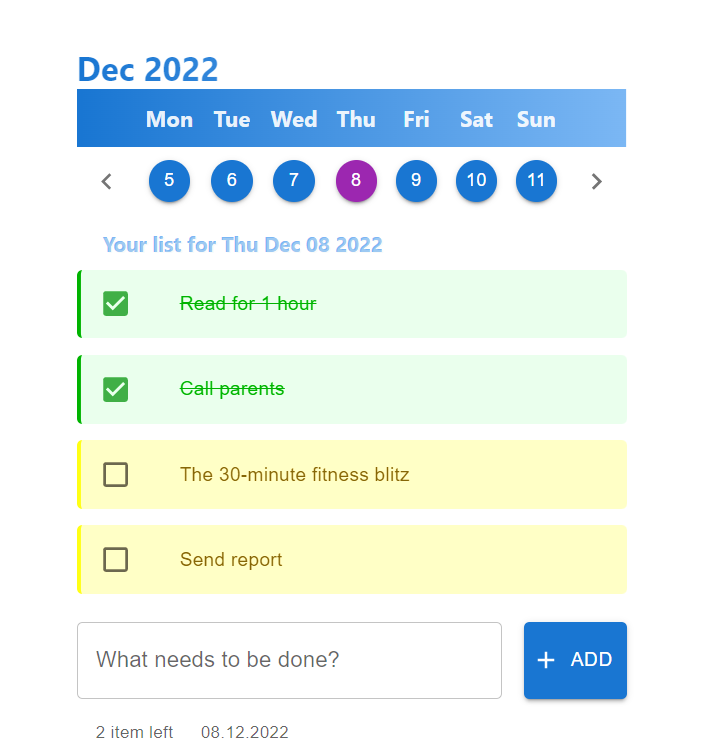

# React Todo App
A simple Todo app built with Create React App.

This project was created by using Class components.

## Features

* Calendar
* Add a todo 
* Mark as completed
* Remove a todo
* Todo persistence
* Responsive design

## Project screenshot

## Future features

* Filter todos
* Todo categorization

## Tech Stack

* ES6
* React
* MUI 
* Redux
* Redux Toolkit
* Redux Persist

